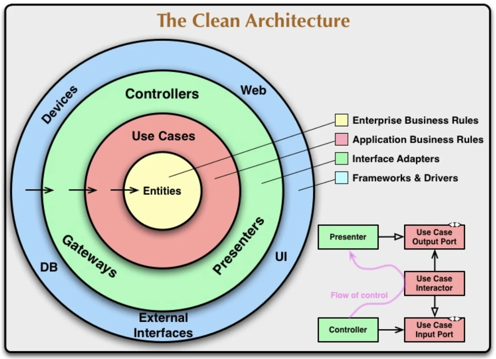

# Clean Architecture

## Khái niệm

Clean architecture là một kiến trúc dựa trên nguyên lý loại bỏ sự phụ thuộc giữa các tầng trong xử lý (các layer) trong ứng dụng.

Nguyên lý này được kế thừa và phát triển theo nguyên lý **Dependency Inversion** trong nguyên lý **[SOLID](../programming-techniques/solid.md)**.

Clean architecture bao gôm 4 lớp:

- [Entities](#entities).
- [Use cases](#use-cases).
- [Interface adapter](#interface-adapter).
- [Frameworks & drivers](#frameworks--drivers).

Các layer này sẽ làm việc với nhau thông qua các Interface. Layer trong sẽ không biết đến sự tồn tại của các layer ngoài.

## Entities

Đây là lớp trong cùng, là nơi chứa các Object, các thuộc tính, các rule business của Object đó.

Có thể hiểu Entities là nới chứa các Model (hay entity), các properties & method của Model đó, tuân thủ theo nguyên tắc **Encapsulation** trong **[OOP](../programming-techniques/oop.md)**)

## Use cases

Là tầng xử lý các business logic theo từng use case. Có thể hiểu đây là tầng service trong ứng dụng.

## Interface adapter

## Frameworks & drivers
