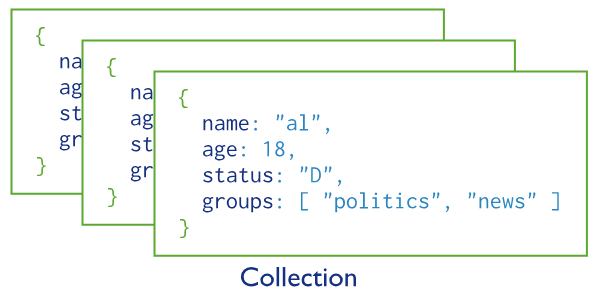

# Databases and Collections

## Tổng quan

MongoDB lưu trữ dữ liệu dưới dạng Document và được tổng hợp trong các [Collections](#collections) (tương tự như table của RDBMS).

[Databases](#databases) là tập hợp của các Collections.

## Databases

Database là tập hợp các Collection.

Để sử dụng một database, ta dùng câu lệnh:

```javascript
use myDB
```

Nếu trường hợp database không tồn tại (ở đây là myDB), thì Mongo sẽ tự động tạo ra database với tên là **myDB**.

```javascript
use myDB

db.myCollection.insertOne({ name: "Dark Lord" })

```

Ở ví dụ trên, mongo sẽ tạo ra database myDB nếu nó chưa tồn tại, sau đó tạo ra collection tên **myCollection** và insert record vào trong collection đó.

## Collections

MongoDB lưu trữ Document trong các Collections.



Để tạo một collection có thể làm như sau:

```javascript
db.myCollection.insertOne({ name: "Dark Lord" })
db.myCollection.createIndex({ "name": 1})
```

Cả hai phương thức insertOne() và createIndex() đều có thể sử dụng để tạo ra Collection nếu nó chưa tồn tại.

Ngoài ra, cũng có thể sử dụng db.createCollection() để tạo collection.

```javascript
db.createCollection("collection_name")
```

Cách này được gọi là **Explicit Creation**.
