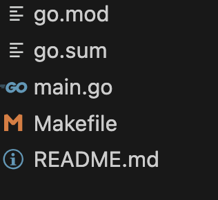
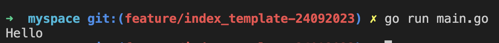

# Golang - Basic syntax

## Cấu trúc project golang cơ bản

Để tạo một project Go cơ bản thì làm theo các bước:

- Tạo file ```main.go```.
- Khai báo package ```main```.
- Khai báo hàm ```main()```
- Init ```go mod```.
- Chạy app với ```go run```.

Cấu trúc project:

```md
├── main.go
├── go.mod
├── vendor
```

```main.go```: đây là file chứ entry point của ứng dụng. Thông thường sẽ đặt là **main.go**.

```go.mod```: file sẽ được khởi tạo bằng câu lệnh ```go mod init [project_name]```. File này sẽ quản lý các thư viện, version cần thiết của dự án. Có thể hiểu nó tương tự file pom trong Maven.

```vendor```(optional): đây là thư mục hiển thị các thư viện của dự án (các thư viện được khai báo trong ```go.mod```). Folder này được tạo ra bằng câu lệnh ```go mod vendor```.
> *```vendor``` chỉ là cách hiển thị trực quan hơn của ```go.mod```. Việc có hay không có folder này không ảnh hưởng đến dự án*.



## ```main.go```

Như đã nói ở trên, file này sẽ chứa entry point của ứng dụng.

```go
package main

import "fmt"

func main() {
    fmt.Println("Hello")
}
```

Khi start project, go compiler sẽ tìm đến thư mục ```main```, sau đó tìm đến hàm ```main()``` để thực thi.

Các code go được viết trong hàm ```main()``` sẽ được thực thi trước tiên.

Sử dụng từ khoá ```import``` để thêm vào trong file các thư viện cần thiể để sử dụng. Tương tự như ```import``` trong java.

Để chạy dự án golang, chúng ta sẽ sử dụng câu lệnh ```go run [path_to_main_file]```.



## Tiếp theo

- [Comments](./GL02-Comments.md).
